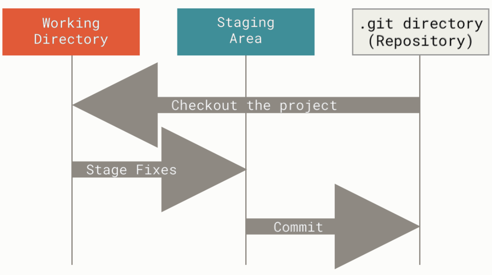
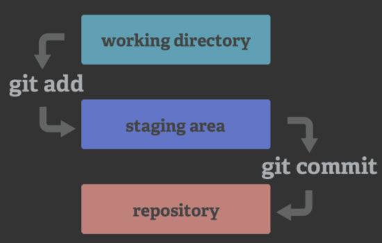

## Introduction
It is often difficult to keep track of all the changes to codes and files in a long-term project, especially when you have multiple collaborator. One of the best ways to target this problem is to use a proper tool (such as Git and Github) for version control so that you can record the history of modifications and roll back to a specific version whenever it is needed.

## Git and Github
- **Git** is a version control software that is fully distributed - meaning that each project folder contains the full history of the project. These project folders are also called `repositories` and can be on several computers, or servers.
- A **repository in git** is the `.git/` folder inside of your directory. This repository tracks all changes made to files in your project and contains your project history. Usually we refer to the git repository as the **local repository**.
- **Github** is a **online code hosting platform** that is **based on git**. Here you can store, track and publish code (and code only, do NOT use github for data!). On Github you can collaborate with colleagues and work on projects together.
- A **repository in github** is also known as a **remote directory**, which stores the project and revision history in a online host.

## How Git works
A git project mainly contains three sections:

- **Working directory**: The folder where you work with all the files in your project. All the modifications you make first happen in this directory.
- **Staging area**: This section declares which modification in working will be sent to `git repository` using command line `git add`
- **Git repository**: This is `.git/` folder under your working directory, which records the modification hisotry of the git project (working directory). Note that Git repsository only retreive information from **Staging area**. Any change that is not decared in **Staging area** will not be recorded. The command to update Git repository is `git commit`.

The following picture shows the relationship among these three sections:

{width="500"}

## Starting with Git
### 1. Initialization
To be able to use git, we need to initialize a `git repository` under your **project/working directory**:
```{bash}
#| eval: false

git init
```

### 2. Add the first record
The newly created `git repository` is empty, so we need to add the record of the current status of **working directory** into `git repository`.

#### 2.1 Declaration in staging area
This step declares which file will be committed to `git repository`.

**Note** that you always need to perform this step whenever you want to update `git repository`.
```{bash}
#| eval: false

git add --all # all files to be committed

git add [filename] # specify a file to committed
```

#### 2.2 Commit to git repository
Commit your staged content as a new commit snapshot. 
```{bash}
#| eval: false

git commit -m “[descriptive message]”
```

### 3. Set up remote repository on Github
Now that we have a local history under `.git/`, we want to sychronize with a **remote repository** on Github.

#### 3.1 Connect to Github through SSH
```{bash}
#| eval: false

ssh -T git@githun.com
```

#### 3.2 Link local git repository to the remote one
Creating a new repository on Github is recommanded then use the following command to set up the link:
```{bash}
#| eval: false

git remote add origin [URL_of_your_github_repository]
```
**Note** that you need to have at least one commit in local repository before you can link with the remote repository.

#### 3.3 Rename the branch in git repository as main
The default branch name when initialized is `master`, rename it as `main`.
```{bash}
#| eval: false

git branch -M main
```

#### 3.4 Push local branch commits to the remote repository
- Here `main` refers to the local branch we want to push
- `origin` refers to the name of the remote repository
- use command `git branch -a` we can see the remote repository has the branch `remotes/origin/main`, so by default `git push` will push the current local branch to the remote branch with the same name.
```{bash}
#| eval: false

git push -u origin main
```
- The standard form of push command:
```{bash}
#| eval: false

git push REMOTE-NAME BRANCH-NAME
```

### 4. Updating repository
- Basically we follow the these steps:
Staging/declaration-Commit-push.
- you don´t need to speciffy which branch to push as long as your local branch shares name with one of the remote branches
```{bash}
#| eval: false

git add [filename]
git commit -m “[descriptive message]”
git push
```

{width="500"}

### 5. Working with branches
Sometimes it is good to create a new branch (from the main branch) and make all the changes in new branch first, then merge with the main one.

#### 5.1 List branches
```{bash}
#| eval: false

git branch # show all the local branches
git branch -a # flag -a indicates also showing remote branches
```

#### 5.2 Create a new branch
```{bash}
#| eval: false

git branch [branch_name]
```

#### 5.3 Switch to a branch
Switch to another branch and check it out into your working directory.
```{bash}
#| eval: false

git checkout [branch_name]
```

#### 5.4 Merge branches
Merge the specified branch’s history into the current one.
```{bash}
#| eval: false

git merge [branch_name]
```


```{r}
#| echo: false

# It is empty block to make sure bash code block could be rendered.
```