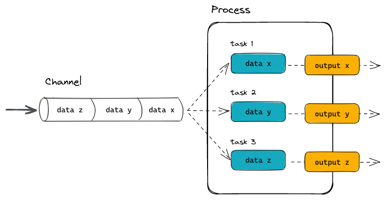

## Introduction to workflow manager
Data processing and analysis often include multiple steps that are written in separate scripts. To complete the full process, we need to run the scripts one by one in a correct order, which could be quite inefficient and inconvenient. Workflow manager aims to target this kind of problems by connecting different steps of the workflow in the same framework and building a pipeline. With a workflow manager, we can easily execute the full pipeline from the beginning or rerun from a specific step using a single command. Worlflow managers also make it easier to share pipelines and reproduce the results.

**nextflow** and **snakemake** are two workflow managers that are often used in the field.

## Nextflow

### 1. Coding lanauge
#### 1.1 Process and Channels
- Nextflow is a Domain Specific Language (DSL) implemented as an extension of the Groovy programming language. `process` and `channel` are two major parts of a nextflow script.
- `process` defines the block where codes are being executed.
- Each `process` can be written in **any scripting language** that can be executed by the Linux platform (Bash, Perl, Ruby, Python, etc.). This is done in the script part of the process.
- `channel` defines the input and output of the `process`

{width="500"}

The following graph shows how Nextflow process raw data through fastqc and multiqc.  
[Source: Software carpentries](https://carpentries-incubator.github.io/workflows-nextflow/01-getting-started-with-nextflow.html)

{width="500"}

#### 1.2 Example script
- Below is an example of a nextflow script:
```{bash}
#| eval: false

#!/usr/bin/env nextflow

params.greeting = 'Hello world!'
greeting_ch = Channel.of(params.greeting)

process SPLITLETTERS {
    input:
    val x

    output:
    path 'chunk_*'

    script:
    """
    printf '$x' | split -b 6 - chunk_
    """
}

process CONVERTTOUPPER {
    input:
    path y

    output:
    stdout

    script:
    """
    cat $y | tr '[a-z]' '[A-Z]' 
    """
}

workflow {
    letters_ch = SPLITLETTERS(greeting_ch)
    results_ch = CONVERTTOUPPER(letters_ch.flatten())
    results_ch.view{ it }
}
```

- `params.greeting`: Hold the parameters that can be used as input to the pipeline. Prefix `params` indicates the variable is a parameter.
- `greeting_ch`: Set up the input channel using parameter `params.greeting`.
- `process SPLITLETTERS`: Define a executable process named `SPLITLETTERS`. A `process` mainly includes `input`, `output` and `script`.
- `input`: Define the input to `process`. The input can be values (`val`), files (`path`) or other qualifiers. Here `val x` indicates that we assign a value as to a variable named x, which will be used as input in `process`.
- `output`: Define the output of a process. Here `path 'chunk_*'` indicates the process to expect an output file (path), with a filename starting with “chunk_”, as output from the script. The process sends the output as a `channel`.
- `workflow`: This is the block where we put everything together. For example, in `letters_ch = SPLITLETTERS(greeting_ch)` we take input from channel `greeting_ch`, go through `process SPLITLETTERS` and output in channel `letters_ch` (Note that there are files in this `channel` because the output in `process SPLITLETTERS` is defined by `path`).

### 2. Execution
#### 2.1 Run script
Nextflow script can be run directly:
```{bash}
#| eval: false

# with pixi environment
pixi run nextflow run hello.nf

# without pixi
nextflow run hello.nf

```

The output on the screen will show the status of each `process`:
```{bash}
#| eval: false

 N E X T F L O W   ~  version 25.04.7

Launching `hello.nf` [jolly_faraday] DSL2 - revision: f5e335f983

executor >  local (3)
[96/fd5f07] SPLITLETTERS (1)   [100%] 1 of 1 ✔
[7e/dad424] CONVERTTOUPPER (2) [100%] 2 of 2 ✔
HELLO 
WORLD!

```

#### 2.2 Modify and resume
After the first run of nextflow, the output of each `process` will be store in nextflow. If we modify one `process`, we can use parameter `-resume` to rerun the pipeline starting from the modified `process`.  
For example we make the following changes in `process CONVERTTOUPPER`:
```{bash}
#| eval: false

process CONVERTTOUPPER {

    input:
    path y

    output:
    stdout

    script:
    """
    rev $y
    """
}

```

Then we can use the following command to resume:
```{bash}
#| eval: false

pixi run nextflow run hello.nf -resume

```

#### 2.3 Input parameters from outside of the script
In the example script we define a parameter `para.greeting`. The default value of this parameter is 'Hello world!', but we can also change this vaule by specifying in command line:
```{bash}
#| eval: false

pixi run nextflow run hello.nf -resume --greeting 'Bonjour le monde!'

```

Here we change the content of `para.greeting` into 'Bonjour le monde!'

#### 2.4 Clean up Nextflow
Check out what you have run in a nextflow directory:
```{bash}
#| eval: false

pixi run nextflow log

```

Clean up all the project cache and the work directories:
```{bash}
#| eval: false

pixi run nextflow clean

```

Clean up all runs before the named run and forces the clean up:
```{bash}
#| eval: false

pixi run nextflow clean -before <RUN NAME> -f

```


```{r}
#| echo: false

# It is empty block to make sure bash code block could be rendered.
```